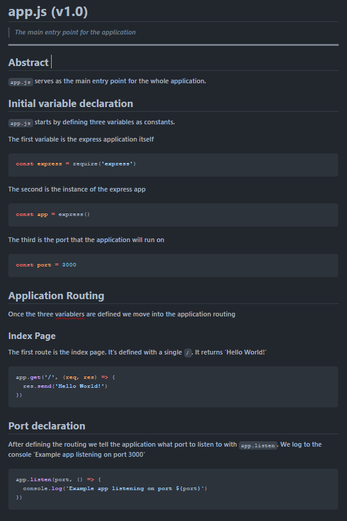

# Literate Coding Parser

> *A node based literate coding parser. A new way to code! Code by writing documentation!*

---

- **GitHub:** https://github.com/8rents/literate-coding-parser
- **NPM:** N/A

---

## About Literate Coding

> *The following about section is taken from the [Wikipedia article on Literate Programming](https://en.m.wikipedia.org/wiki/Literate_programming)*

Literate programming is writing out the program logic in a human language with included (separated by a primitive markup) code snippets and macros.

It was first introduced in 1984 by Donald Knuth, who intended it to create programs that were suitable literature for human beings. He implemented it at Stanford University as a part of his research on algorithms and digital typography.

### File Extensions

Since we are writing a **literate javascript file**, `.js` is used and then appended with `.lit` after the codes file extension. 

**Note:** *That since the file extension is `.js` the compiler will know all the code is javascript, so we won't need to specify the language in any of the markdown code fences.*


### YAML Front matter

Each file is started with YAML front matter. Then you write all about how the file works, what it does, and eventually within the markdown write a code snippet that you will document.

Front matter will be used to add metadata to code and documentation and to toggle file specific compilation options.

```yaml
---
title: app.js
description: The main entry point for the application
version: 1.0
---
```

## Example: `app.js`

This example `app.js` file is the main application file of the hello world of the javascript express app.

When coding using literate coding you write all of your code within markdown files. 

### `app.js.lit`

````markdown
# `app.js` (v1.0)

> *The main entry point for the application*

---

## About

`app.js` serves as the main entry point for the whole application.

## Initial variable declaration

`app.js` starts by defining three variables as constants. 

#1 the express application itself

```javascript
const express = require('express')
```

#2 The instance of the express app

```javascript
const app = express()
```

#3 The port that the application will run on

```javascript
const port = 3000
```

## Application Routing

Once the three variables are defined we move into the application routing. 

### Express `get` method

Routes are defined using the `get` method of the express `app`. `get` takes a URI as the first parameter. The second parameter is a function with parameters for request (`req`) an result (`res`).

The **reqest (`req`)** is the first parameter or the path. In this case `/`.

The **result (`res`)** is what should happen if the request is met. The result takes a method `.send`. In this case we are sending the string 'Hello World'

#### Index Page

The first and only get request is the index page. It's defined with a single `/`. It returns 'Hello World!'

```javascript
app.get('/', (req, res) => {
  res.send('Hello World!')
})
```

## Port declaration

After defining the routing we tell the application what port to listen to with `app.listen`. We log to the console 'Example app listening on port 3000'

```javascript
app.listen(port, () => {
  console.log(`Example app listening on port ${port}`)
})
```

````

This is a literate JavaScript file that has the code for an express hello world app.

---

## File Compilation

Two types of files are produced when a `.lit` file is compiled.

### Source Code Files: `app.js`


```javascript
const express = require('express')
const app = express()
const port = 3000

app.get('/', (req, res) => {
  res.send('Hello World!')
})

app.listen(port, () => {
  console.log(`Example app listening on port ${port}`)
})
````

All of the markdown is stripped away leaving just the JavaScript.

#### app.js.md will look like this:



## Configuration using YAML

Using a yaml file we tell the compiler where to compile the files to:

### `config.yml`

The `config.yml` file is located in the root directory of a literate coding project.

```yaml
app: express-hello-world
source_dir: src
compilation_dir: app
docs_dir: docs
index_filename: README
```

### Individual file yaml configuration using frontmatter

Indivudual literate files can be configured using yaml frontmatter

```yaml
lit:
# all literate coding configs
  name: express-hello-world
  # app name
  compile:
  # compile options
	dir: app
	# where src files compile to
	src:
	# source file options
	   dir: src
	   # where source files are
       comments: none
	   # should compiled source files have any comments  
	   # options are: none, headers, all
	   minify: no
	   # should the files be minified
	docs:
    # docs options
	   dir: docs
	   # where docs compile to
	   index: README
	   # what the index files filename should be
```

##### This will create the directory structure:

```css
express-hello-world/
    config.yml
	README.md
	LICENSE
	package.json
	src/
		app.js.lit
	app/
		app.js
	docs/
		README.md
		flow.md
		app.js.md
			modules/
				README.md
```

## Automatic linking of files in markdown

The parser will automatically create index files (README.md) and link all sub files and folders within them.

---

**🤍 2025** [**Brenton Holiday**](https://brenton.holiday/) **|** [GitHub](https://github.com/8rents?tab=repositories)

